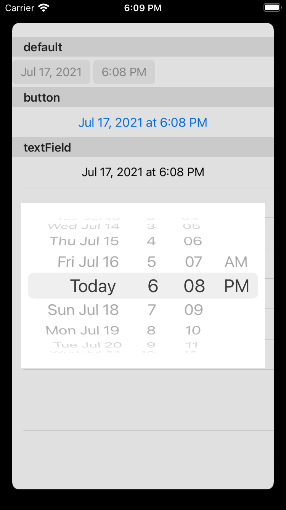
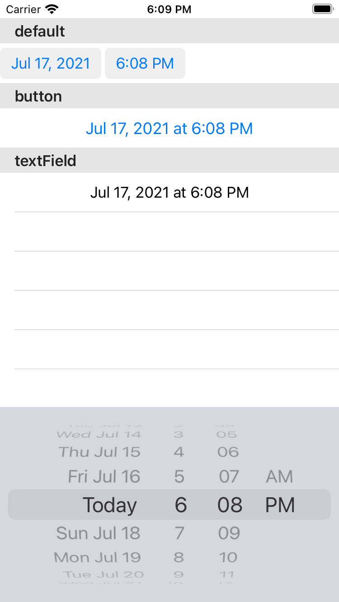

#  UIDatePicker become as  button after 13.4
## workaround
`
if #available(iOS 13.4, *) {
    datePicker.preferredDatePickerStyle = .wheels
} 
`
## My Choice
1. I wish UIDatePicker  use as `Button` on all iOS version
2. `DatePicker` use as  UIDatePicker
3. Show `DatePicker` as Keyboard or PopoverPresentation

## Style
1. default. \
    . \
    (Below 13.4, use button style.). 
2. button. \
    Show `DatePicker` as  PopoverPresentation. \
    . 
3. textField. \
    Show `DatePicker` as Keyboard. \
    . 
